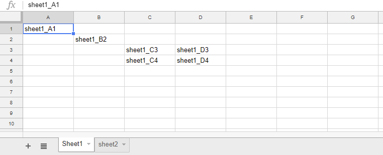
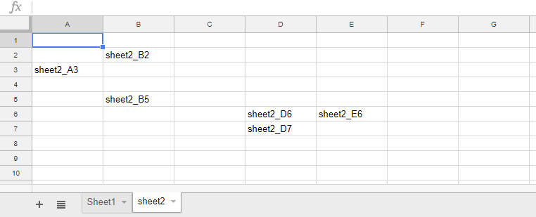
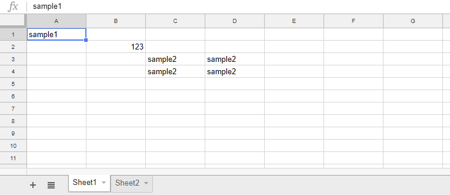
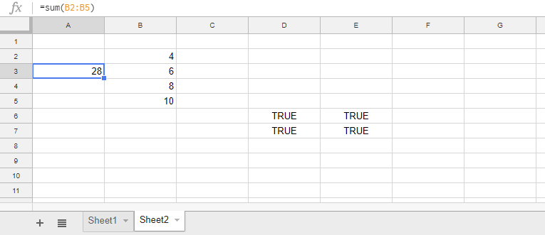
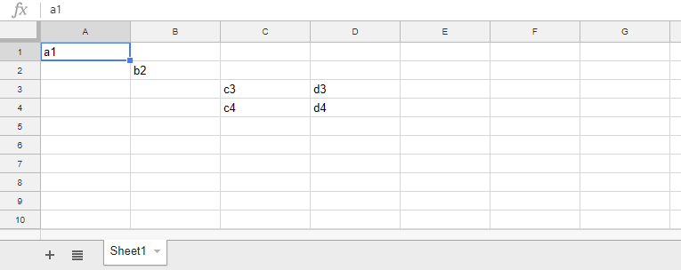
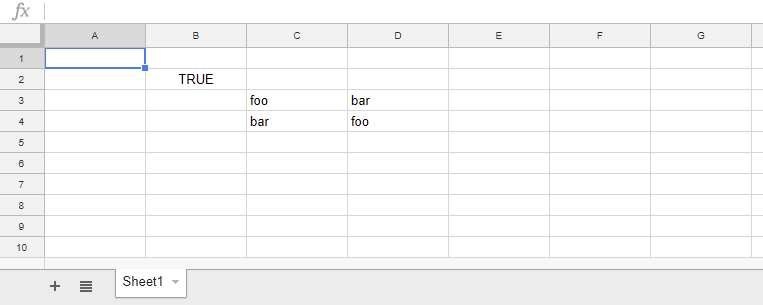
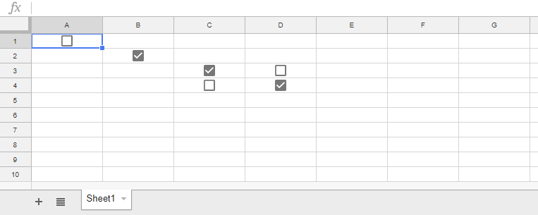

RangeListApp
=====

# Overview
**RangeListApp is a GAS library for retrieving, putting and replacing values for Spreadsheet by a range list with a1Notation using Google Apps Script (GAS).**

# Description
There is [Class RangeList](https://developers.google.com/apps-script/reference/spreadsheet/range-list) as one of classes for Spreadsheet. There is ``setValue(value)`` in Class RangeList as a method. ``setValue(value)`` puts ``value`` to the cells of range list. Recently, when I used this method, I noticed that the following situations what I want cannot be achieved.

- Put the different values to each cell of the range list.
- Retrieve values from each cell of the range list.
- Replace values of each cell of the range list using regex.
- Use various sheets to the range list.
- Put checkbox to each cell of the range list.

Although these might be able to be used by the future update, I created this library, because I wanted to achieve them soon. If this library is also useful for you, I'm glad.

# Library's project key
~~~
1L44xvi-AsdwbYgqeb63e2i-7PpC01Mt-1fgNO2HpTTvAHPMU1HteAIsY
~~~

# How to install
1. [Install RangeListApp library](https://developers.google.com/apps-script/guides/libraries).
    - Library's project key is **``1L44xvi-AsdwbYgqeb63e2i-7PpC01Mt-1fgNO2HpTTvAHPMU1HteAIsY``**.
1. Enable Sheets API at API console
    - On script editor
    - Resources -> Cloud Platform project
    - View API console
    - At Getting started, click Enable APIs and get credentials like keys.
    - At left side, click Library.
    - At Search for APIs & services, input **Sheets API**. And click Sheets API.
    - Click Enable button.
        - If it has already been enabled, please don't turn off.

<u>Installing is done! You can use RangeListApp.</u>

> At the first run of the script using library, the authorization screen is displayed. Please authorize it. By this, you can use Sheets API. This authorization is required to do for only the first run.

# Methods
| Methods | Return | Descriptions |
|:------|:------|:------|
| getValues() | Object | Retrieve values from each cell using range list. This works like [``getValues()`` of Class Range](https://developers.google.com/apps-script/reference/spreadsheet/range#getValues()). |
| getDisplayValues() | Object | Retrieve display values from each cell using range list. This works like [``getDisplayValues()`` of Class Range](https://developers.google.com/apps-script/reference/spreadsheet/range#getDisplayValues()). |
| getFormulas() | Object | Retrieve formulas from each cell using range list. This works like [``getFormulas()`` of Class Range](https://developers.google.com/apps-script/reference/spreadsheet/range#getformulas). |
| setValues(values) | Object | Put values to cells of range list. This works like [``setValues()`` of Class Range](https://developers.google.com/apps-script/reference/spreadsheet/range#setvaluesvalues). Inputted the range list is returned. |
| replaceValues(regex, value) | Object | Replace values of cells of range list using regex. Inputted the range list is returned. |
| replaceFormulas(regex, value) | Object | Replace formulas of cells of range list using regex. Inputted the range list is returned. |
| setCheckBox(values) | Object | Put checkbox to cells of range list. Inputted the range list is returned. |
| [expandA1Notations(rangeList)](#expandA1Notations) | Object | Expand a1Notation. For example, ``A1:C2`` is expanded to ``"A1","B1","C1","A2","B2","C2"``. |

I would like to add more methods in the future.

# Usage
## 1. getValues(), getDisplayValues(), getFormulas()
These methods retrieve values from each cell using range list.

As the samples, it uses the following sheets.

In this sample script, the values of ``"A1", "B2", "C3:D4", "sheet2!A3", "sheet2!B2:B5", "sheet2!D6:E7"`` are retrieved using getValues().

- When the active sheet is "Sheet1", "A1", "B2" and "C3:D4" mean "Sheet1!A1", "Sheet1!B2" and "Sheet1!C3:D4", respectively.
- When you want to retrieve the values of other sheet, you can use "sheet2!A3", "sheet2!B2:B5" and "sheet2!D6:E7".
- **getFormulas() and getDisplayValues() can also be used like getValues()**. The difference is the result.
    - getFormulas() retrieves the formula of each cell. This works like [getFormulas() of class Range](https://developers.google.com/apps-script/reference/spreadsheet/range#getformulas).
    - getDisplayValues() retrieves the display value of each cell. This works like [getDisplayValues() of class Range](https://developers.google.com/apps-script/reference/spreadsheet/range#getDisplayValues()).

#### Sample script
~~~javascript
var rangeList = ["A1", "B2", "C3:D4", "sheet2!A3", "sheet2!B2:B5", "sheet2!D6:E7"];
var spreadsheet = SpreadsheetApp.getActiveSpreadsheet();
var r = RangeListApp.getSpreadsheet(spreadsheet).getRangeList(rangeList).getValues();

// var r = RangeListApp.getSpreadsheet(spreadsheet).getRangeList(rangeList).getFormulas();
// var r = RangeListApp.getSpreadsheet(spreadsheet).getRangeList(rangeList).getDisplayValues();
~~~

#### Result
These values can be retrieved by one API call. All values are 2 dimensional array.

~~~json
[
    {"range":"Sheet1!A1","values":[["sheet1_A1"]]},
    {"range":"Sheet1!B2","values":[["sheet1_B2"]]},
    {"range":"Sheet1!C3:D4","values":[["sheet1_C3","sheet1_D3"],["sheet1_C4","sheet1_D4"]]},
    {"range":"sheet2!A3","values":[["sheet2_A3"]]},
    {"range":"sheet2!B2:B5","values":[["sheet2_B2"],[],[],["sheet2_B5"]]},
    {"range":"sheet2!D6:E7","values":[["sheet2_D6","sheet2_E6"],["sheet2_D7"]]}
]
~~~

## 2. setValues()
This method put values to each cell using range list.

#### Sample script
~~~javascript
var rangeList = ["A1", "B2", "C3:D4", "sheet2!A3", "sheet2!B2:B5", "sheet2!D6:E7"];
var values = ["sample1", 123, "sample2", "=sum(B2:B5)", "=ROW() * 2", true];
var spreadsheet = SpreadsheetApp.getActiveSpreadsheet();
var r = RangeListApp.getSpreadsheet(spreadsheet).getRangeList(rangeList).setValues(values);
~~~

- Lengths of ``rangeList`` and ``values`` are required to be the same. For example, 2nd index of ``rangeList`` (``"B2"``) is corresponding to the 2nd index of ``values`` (``123``).
- When the range including several cells is set to ``rangeList`` like ``"C3:D4"``, ``"sample2"`` is put to all cells of range.
- When you want to put a formula, you can use it like ``"=sum(B2:B5)"``. This library checks the top letter of each element in ``values``. When it is ``=``, the element is put as a formula.
- For example, when you want to put ``=ROW() * 2`` as a string, you can put it by giving ``==ROW() * 2``.
    - When ``==`` is used for the top letter of formula, the formula is put as a string. When it is put, ``==`` is converted to ``=``.
- setValues() returns rangeList.
- For above sample script, when ``var values = "sample";`` is used, "sample" is put to all cells of "rangeList". This works like "setValue(value)" of [Class RangeList](https://developers.google.com/apps-script/reference/spreadsheet/range-list).

#### Result

## 3. replaceValues(), replaceFormulas()
These methods replace values of each cell using range list by regex.

#### Sample script
~~~javascript
var rangeList = ["A1", "B2", "C3:D4"];
var spreadsheet = SpreadsheetApp.getActiveSpreadsheet();
var regex = new RegExp("[a-d]");
var value = "foo";
var r = RangeListApp.getSpreadsheet(spreadsheet).getRangeList(rangeList).replaceValues(regex, value);
~~~

- In this library, it uses [String.prototype.replace()](https://developer.mozilla.org/en-US/docs/Web/JavaScript/Reference/Global_Objects/String/replace) for replacing values. So you can use regexp and substr for ``regex``.
- In these methods, ``regex`` and ``value`` which can be used is one value, respectively.
- When ``replaceFormulas()`` instead of ``replaceValues()`` is used, it can replace formulas in each cell.

#### Result

## 4. setCheckBox()
This method puts checkbox to each cell using range list.

#### Sample script
~~~javascript
var rangeList = ["A1", "B2", "C3:D4"];
var values = [[], [], ["foo", "bar"]];
var spreadsheet = SpreadsheetApp.getActiveSpreadsheet();
var r = RangeListApp.getSpreadsheet(spreadsheet).getRangeList(rangeList).setCheckBox(values);
~~~

- Basic usage is the same with ``setValues()``.
- In the sample script, ``["foo", "bar"]`` of ``values`` means ``true`` and ``false``, respectively.

#### Result
##### From :

##### To :

## 5. expandA1Notations()
~~~javascript
var rangeList = ["A1:E3", "B10:W13", "EZ5:FA8", "AAA1:AAB3"];
var r = RangeListApp.expandA1Notations(rangeList);
~~~

- This is one of methods of Class RangeListApp.
- Methods of "columnToLetter" and "letterToColumn" are from [Stackoverflow](https://stackoverflow.com/a/21231012/7108653). When I saw the thread, I could notice about this method. Thank you so much.

#### Result
~~~
[
  ["A1","B1","C1","D1","E1","A2","B2","C2","D2","E2","A3","B3","C3","D3","E3"],
  ["B10","C10","D10","E10","F10","G10","H10","I10","J10","K10","L10","M10","N10","O10","P10","Q10","R10","S10","T10","U10","V10","W10","B11","C11","D11","E11","F11","G11","H11","I11","J11","K11","L11","M11","N11","O11","P11","Q11","R11","S11","T11","U11","V11","W11","B12","C12","D12","E12","F12","G12","H12","I12","J12","K12","L12","M12","N12","O12","P12","Q12","R12","S12","T12","U12","V12","W12","B13","C13","D13","E13","F13","G13","H13","I13","J13","K13","L13","M13","N13","O13","P13","Q13","R13","S13","T13","U13","V13","W13"],
  ["EZ5","FA5","EZ6","FA6","EZ7","FA7","EZ8","FA8"],
  ["AAA1","AAB1","AAA2","AAB2","AAA3","AAB3"]
]
~~~

-----

# Licence
[MIT](LICENCE)

# Author
[Tanaike](https://tanaikech.github.io/about/)

If you have any questions and commissions for me, feel free to tell me.

# Update History
* v1.0.0 (July 27, 2018)

    1. Initial release.

* v1.0.1 (September 13, 2018)

    1. [New method of "expandA1Notations"](#expandA1Notations) was added. This method can expand the a1Notations. For example, ``A1:C2`` is expanded to ``"A1","B1","C1","A2","B2","C2"``.

[TOP](#TOP)
